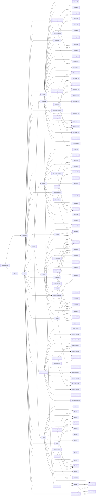

## Tokens Overview

```mermaid
graph LR;
    md[Material Design];
    md --> md.sys[System];
    md --> md.ref[Reference];

    md.ref --> md.ref.palette[Palette];

    md.ref.palette --> primary[Primary];
    primary ----> md.ref.palette.primary0[Primary 0];
    primary ----> md.ref.palette.primary10[Primary 10];
    primary ----> md.ref.palette.primary20[Primary 20];
    primary ----> md.ref.palette.primary30[Primary 30];
    primary ----> md.ref.palette.primary40[Primary 40];
    primary ----> md.ref.palette.primary50[Primary 50];
    primary ----> md.ref.palette.primary60[Primary 60];
    primary ----> md.ref.palette.primary70[Primary 70];
    primary ----> md.ref.palette.primary80[Primary 80];
    primary ----> md.ref.palette.primary90[Primary 90];
    primary ----> md.ref.palette.primary95[Primary 95];
    primary ----> md.ref.palette.primary99[Primary 99];
    primary ----> md.ref.palette.primary100[Primary 100];

    md.ref.palette --> secondary[Secondary];
    secondary ----> md.ref.palette.secondary0[Secondary 0];
    secondary ----> md.ref.palette.secondary10[Secondary 10];
    secondary ----> md.ref.palette.secondary20[Secondary 20];
    secondary ----> md.ref.palette.secondary30[Secondary 30];
    secondary ----> md.ref.palette.secondary40[Secondary 40];
    secondary ----> md.ref.palette.secondary50[Secondary 50];
    secondary ----> md.ref.palette.secondary60[Secondary 60];
    secondary ----> md.ref.palette.secondary70[Secondary 70];
    secondary ----> md.ref.palette.secondary80[Secondary 80];
    secondary ----> md.ref.palette.secondary90[Secondary 90];
    secondary ----> md.ref.palette.secondary95[Secondary 95];
    secondary ----> md.ref.palette.secondary99[Secondary 99];
    secondary ----> md.ref.palette.secondary100[Secondary 100];

    md.ref.palette --> tertiary[Tertiary];
    tertiary ----> md.ref.palette.tertiary0[Tertiary 0];
    tertiary ----> md.ref.palette.tertiary10[Tertiary 10];
    tertiary ----> md.ref.palette.tertiary20[Tertiary 20];
    tertiary ----> md.ref.palette.tertiary30[Tertiary 30];
    tertiary ----> md.ref.palette.tertiary40[Tertiary 40];
    tertiary ----> md.ref.palette.tertiary50[Tertiary 50];
    tertiary ----> md.ref.palette.tertiary60[Tertiary 60];
    tertiary ----> md.ref.palette.tertiary70[Tertiary 70];
    tertiary ----> md.ref.palette.tertiary80[Tertiary 80];
    tertiary ----> md.ref.palette.tertiary90[Tertiary 90];
    tertiary ----> md.ref.palette.tertiary95[Tertiary 95];
    tertiary ----> md.ref.palette.tertiary99[Tertiary 99];
    tertiary ----> md.ref.palette.tertiary100[Tertiary 100];

    md.ref.palette --> neutral[Neutral];
    neutral ----> md.ref.palette.neutral0[Neutral 0];
    neutral ----> md.ref.palette.neutral10[Neutral 10];
    neutral ----> md.ref.palette.neutral20[Neutral 20];
    neutral ----> md.ref.palette.neutral30[Neutral 30];
    neutral ----> md.ref.palette.neutral40[Neutral 40];
    neutral ----> md.ref.palette.neutral50[Neutral 50];
    neutral ----> md.ref.palette.neutral60[Neutral 60];
    neutral ----> md.ref.palette.neutral70[Neutral 70];
    neutral ----> md.ref.palette.neutral80[Neutral 80];
    neutral ----> md.ref.palette.neutral90[Neutral 90];
    neutral ----> md.ref.palette.neutral95[Neutral 95];
    neutral ----> md.ref.palette.neutral99[Neutral 99];
    neutral ----> md.ref.palette.neutral100[Neutral 100];

    md.ref.palette --> neutralVariant[Neutral Variant];
    neutralVariant ----> md.ref.palette.neutral-variant0[Neutral Variant 0];
    neutralVariant ----> md.ref.palette.neutral-variant10[Neutral Variant 10];
    neutralVariant ----> md.ref.palette.neutral-variant20[Neutral Variant 20];
    neutralVariant ----> md.ref.palette.neutral-variant30[Neutral Variant 30];
    neutralVariant ----> md.ref.palette.neutral-variant40[Neutral Variant 40];
    neutralVariant ----> md.ref.palette.neutral-variant50[Neutral Variant 50];
    neutralVariant ----> md.ref.palette.neutral-variant60[Neutral Variant 60];
    neutralVariant ----> md.ref.palette.neutral-variant70[Neutral Variant 70];
    neutralVariant ----> md.ref.palette.neutral-variant80[Neutral Variant 80];
    neutralVariant ----> md.ref.palette.neutral-variant90[Neutral Variant 90];
    neutralVariant ----> md.ref.palette.neutral-variant95[Neutral Variant 95];
    neutralVariant ----> md.ref.palette.neutral-variant99[Neutral Variant 99];
    neutralVariant ----> md.ref.palette.neutral-variant100[Neutral Variant 100];

    md.ref.palette --> error[Error];
    error ----> md.ref.palette.error0[Error 0];
    error ----> md.ref.palette.error10[Error 10];
    error ----> md.ref.palette.error20[Error 20];
    error ----> md.ref.palette.error30[Error 30];
    error ----> md.ref.palette.error40[Error 40];
    error ----> md.ref.palette.error50[Error 50];
    error ----> md.ref.palette.error60[Error 60];
    error ----> md.ref.palette.error70[Error 70];
    error ----> md.ref.palette.error80[Error 80];
    error ----> md.ref.palette.error90[Error 90];
    error ----> md.ref.palette.error95[Error 95];
    error ----> md.ref.palette.error100[Error 100];

    md.sys --> md.sys.color[Color];

    md.sys.color ----> md.sys.color.primary[Primary];
    md.sys.color.primary --Light---> md.ref.palette.primary40;
    md.sys.color.primary --Dark---> md.ref.palette.primary80;
    md.sys.color ----> md.sys.color.onPrimary[On Primary];
    md.sys.color.onPrimary --Light---> md.ref.palette.primary100;
    md.sys.color.onPrimary --Dark---> md.ref.palette.primary20;
    md.sys.color ----> md.sys.color.primaryContainer[Primary Container];
    md.sys.color.primaryContainer --Light---> md.ref.palette.primary90;
    md.sys.color.primaryContainer --Dark---> md.ref.palette.primary30;
    md.sys.color ----> md.sys.color.onPrimaryContainer[On Primary Container];
    md.sys.color.onPrimaryContainer --Light---> md.ref.palette.primary10;
    md.sys.color.onPrimaryContainer --Dark---> md.ref.palette.primary90;

    md.sys.color ----> md.sys.color.secondary[Secondary];
    md.sys.color.secondary --Light---> md.ref.palette.secondary40;
    md.sys.color.secondary --Dark---> md.ref.palette.secondary80;
    md.sys.color ----> md.sys.color.onSecondary[On Secondary];
    md.sys.color.onSecondary --Light---> md.ref.palette.secondary100;
    md.sys.color.onSecondary --Dark---> md.ref.palette.secondary20;
    md.sys.color ----> md.sys.color.secondaryContainer[Secondary Container];
    md.sys.color.secondaryContainer --Light---> md.ref.palette.secondary90;
    md.sys.color.secondaryContainer --Dark---> md.ref.palette.secondary30;
    md.sys.color ----> md.sys.color.onSecondaryContainer[On Secondary Container];
    md.sys.color.onSecondaryContainer --Light---> md.ref.palette.secondary10;
    md.sys.color.onSecondaryContainer --Dark---> md.ref.palette.secondary90;

    md.sys.color ----> md.sys.color.tertiary[Tertiary];
    md.sys.color.tertiary --Light---> md.ref.palette.tertiary40;
    md.sys.color.tertiary --Dark---> md.ref.palette.tertiary80;
    md.sys.color ----> md.sys.color.onTertiary[On Tertiary];
    md.sys.color.onTertiary --Light---> md.ref.palette.tertiary100;
    md.sys.color.onTertiary --Dark---> md.ref.palette.tertiary20;
    md.sys.color ----> md.sys.color.tertiaryContainer[Tertiary Container];
    md.sys.color.tertiaryContainer --Light---> md.ref.palette.tertiary90;
    md.sys.color.tertiaryContainer --Dark---> md.ref.palette.tertiary30;
    md.sys.color ----> md.sys.color.onTertiaryContainer[On Tertiary Container];
    md.sys.color.onTertiaryContainer --Light---> md.ref.palette.tertiary10;
    md.sys.color.onTertiaryContainer --Dark---> md.ref.palette.tertiary90;

    md.sys.color ----> md.sys.color.error[Error];
    md.sys.color.error --Light---> md.ref.palette.error40;
    md.sys.color.error --Dark---> md.ref.palette.error80;
    md.sys.color ----> md.sys.color.onError[On Error];
    md.sys.color.onError --Light---> md.ref.palette.error100;
    md.sys.color.onError --Dark---> md.ref.palette.error20;
    md.sys.color ----> md.sys.color.errorContainer[Error Container];
    md.sys.color.errorContainer --Light---> md.ref.palette.error90;
    md.sys.color.errorContainer --Dark---> md.ref.palette.error30;
    md.sys.color ----> md.sys.color.onErrorContainer[On Error Container];
    md.sys.color.onErrorContainer --Light---> md.ref.palette.error10;
    md.sys.color.onErrorContainer --Dark---> md.ref.palette.error90;

    md.sys.color ----> md.sys.color.background[Background];
    md.sys.color.background --Light---> md.ref.palette.neutral99;
    md.sys.color.background --Dark---> md.ref.palette.neutral10;
    md.sys.color ----> md.sys.color.onBackground[On Background];
    md.sys.color.onBackground --Light---> md.ref.palette.neutral10;
    md.sys.color.onBackground --Dark---> md.ref.palette.neutral90;

    md.sys.color ----> md.sys.color.surface[Surface];
    md.sys.color.surface --Light---> md.ref.palette.neutral99;
    md.sys.color.surface --Dark---> md.ref.palette.neutral10;
    md.sys.color ----> md.sys.color.onSurface[On Surface];
    md.sys.color.onSurface --Light---> md.ref.palette.neutral10;
    md.sys.color.onSurface --Dark---> md.ref.palette.neutral90;

    md.sys.color ----> md.sys.color.surfaceVariant[Surface Variant];
    md.sys.color.surfaceVariant --Light---> md.ref.palette.neutral-variant90;
    md.sys.color.surfaceVariant --Dark---> md.ref.palette.neutral-variant30;
    md.sys.color ----> md.sys.color.onSurfaceVariant[On Surface Variant];
    md.sys.color.onSurfaceVariant --Light---> md.ref.palette.neutral-variant30;
    md.sys.color.onSurfaceVariant --Dark---> md.ref.palette.neutral-variant80;

    md.sys.color ----> md.sys.color.inverseSurface[Inverse Surface];
    md.sys.color.inverseSurface --Light---> md.ref.palette.neutral20;
    md.sys.color.inverseSurface --Dark---> md.ref.palette.neutral90;
    md.sys.color ----> md.sys.color.inverseOnSurface[Inverse On Surface];
    md.sys.color.inverseOnSurface --Light---> md.ref.palette.neutral95;
    md.sys.color.inverseOnSurface --Dark---> md.ref.palette.neutral20;
    
    md.sys.color ----> md.sys.color.surfaceTint[Surface Tint] ---> md.sys.color.primary;
    
    md.sys.color ----> md.sys.color.outline[Outline];
    md.sys.color.outline --Light---> md.ref.palette.neutral-variant50;
    md.sys.color.outline --Dark---> md.ref.palette.neutral60;

    md.sys.color ----> md.sys.color.shadow[Shadow];
    md.sys.color.shadow --Light---> md.ref.palette.neutral0;
    md.sys.color.shadow --Dark---> md.ref.palette.neutral0;

    md.sys.color ----> md.sys.color.inversePrimary[Inverse Primary];
    md.sys.color.inversePrimary --Light---> md.ref.palette.primary80;
    md.sys.color.inversePrimary --Dark---> md.ref.palette.primary40;

```
