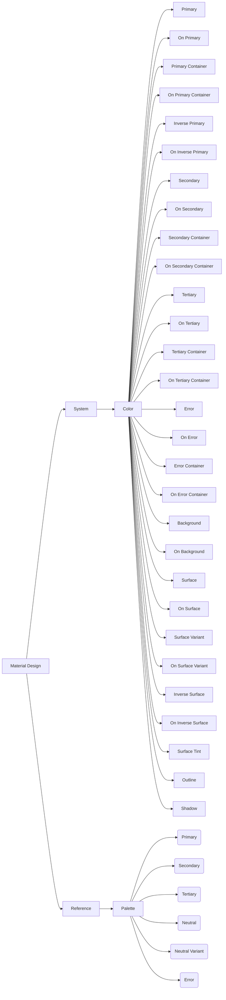

## Tokens Overview

```mermaid
graph LR;
    md[Material Design];
    sys[System];
    ref[Reference];
    md --> sys --> color[Color];
    color --> color.primary[Primary];
    color --> color.onPrimary[On Primary];
    color --> color.primaryContainer[Primary Container];
    color --> color.onPrimaryContainer[On Primary Container];
    color --> color.inversePrimary[Inverse Primary];
    color --> color.onInversePrimary[On Inverse Primary];
    color --> color.secondary[Secondary];
    color --> color.onSecondary[On Secondary];
    color --> color.secondaryContainer[Secondary Container];
    color --> color.onSecondaryContainer[On Secondary Container];
    color --> color.tertiary[Tertiary];
    color --> color.onTertiary[On Tertiary];
    color --> color.tertiaryContainer[Tertiary Container];
    color --> color.onTertiaryContainer[On Tertiary Container];
    color --> color.error[Error];
    color --> color.onError[On Error];
    color --> color.errorContainer[Error Container];
    color --> color.onErrorContainer[On Error Container];
    color --> color.background[Background];
    color --> color.onBackground[On Background];
    color --> color.surface[Surface];
    color --> color.onSurface[On Surface];
    color --> color.surfaceVariant[Surface Variant];
    color --> color.onSurfaceVariant[On Surface Variant];
    color --> color.inverseSurface[Inverse Surface];
    color --> color.onInverseSurface[On Inverse Surface];
    color --> color.surfaceTint[Surface Tint];
    color --> color.outline[Outline];
    color --> color.shadow[Shadow];
    
    md --> ref --> palette[Palette];
    palette --> palette.primary(Primary);
    palette --> palette.secondary(Secondary);
    palette --> palette.tertiary(Tertiary);
    palette --> palette.neutral(Neutral);
    palette --> palette.neutralVariant(Neutral Variant);
    palette --> palette.error(Error);

```
